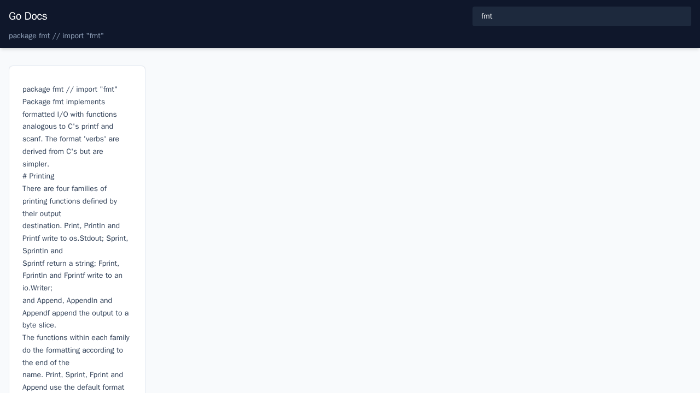

# docs-viewer

A web-based Go package documentation viewer styled with [tailwind-go](https://github.com/dhamidi/tailwind-go).



## What it does

- Runs an HTTP server that renders `go doc -all` output as styled HTML
- Uses tailwind-go to generate Tailwind CSS classes at runtime
- Features a responsive layout with sidebar navigation, code highlighting, and a package search bar

## Usage

```bash
# Default: serves docs for github.com/dhamidi/tailwind-go on :8080
go run .

# Document a specific package
go run . -pkg fmt

# Use a custom address
go run . -addr :3000 -pkg net/http
```

Then open http://localhost:8080 in your browser.

## Flags

| Flag | Default | Description |
|------|---------|-------------|
| `-addr` | `:8080` | Listen address |
| `-pkg` | `github.com/dhamidi/tailwind-go` | Package import path to document |
